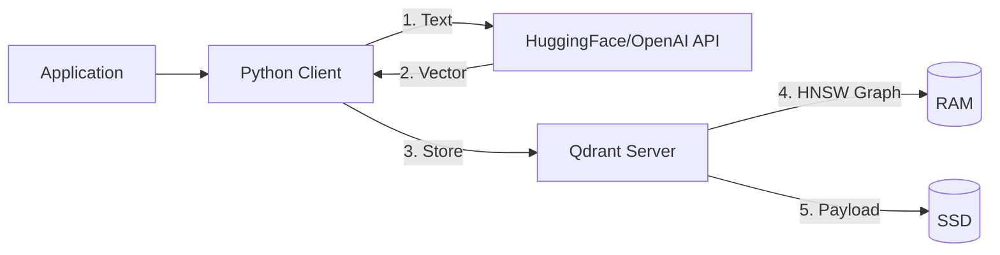

# Section 1: Foundations of Vector Databases

This section lays the groundwork. We explore why we need this technology, where it came from, and how to set it up.

---

## Topic 1: The Problem (SQL & NoSQL Failures)

### 1. The "How" (Theory)

Traditional databases are built on the principle of **Exact Matching**. They excel at finding records that match precise criteria.

**SQL Databases (Relational)**:
*   Use **B-Tree** or **Hash Indexes** to organize data.
*   Optimized for queries like: `SELECT * FROM users WHERE id = 12345`
*   **Strengths**: ACID transactions, joins, referential integrity.
*   **Storage**: Rows and columns. Each cell has a typed value (Integer, String, Date).

**NoSQL Databases (Document/Key-Value)**:
*   Use **Inverted Indices** (like Elasticsearch) or **LSM Trees** (like Cassandra).
*   Optimized for queries like: `MATCH (text:~"cat")` or `GET user:12345`
*   **Strengths**: Horizontal scaling, schema flexibility, fast writes.

**Example - Traditional Search**:
```sql
-- SQL approach
SELECT * FROM movies 
WHERE title LIKE '%dream%' OR plot LIKE '%dream%';

-- Result: Only finds movies with the exact word "dream"
-- Misses: "Nightmare", "REM sleep", "subconscious"
```

### 2. The "Why" (Context)

Real-world questions are **conceptual**, not lexical.

**Case Study: Movie Search Failure**
*   **User Intent**: "I want a movie about entering someone's mind to steal secrets."
*   **Actual Movie**: *Inception* (2010)
*   **Movie Description**: "A thief who enters the subconscious of his targets to extract information."

**The Vocabulary Gap**:
| User Says | Database Has | Match? |
| :--- | :--- | :--- |
| "mind" | "subconscious" | ❌ |
| "steal" | "extract" | ❌ |
| "secrets" | "information" | ❌ |

**Traditional Search Result**: 0 matches (no shared keywords).

This is the **Synonym Problem**. Humans use different words to describe the same concept. SQL/NoSQL cannot bridge this gap because they don't understand *meaning*.

**Another Example: Customer Support**
*   **User**: "My package hasn't arrived."
*   **Knowledge Base**: "Tracking delayed shipments."
*   **Keywords in common**: 0.
*   **Semantic overlap**: 100% (both about delivery issues).

### 3. The "Aha!" Moment 💡
> **"We are searching for Concepts, not Keywords."**

When you realize that "dream theft" and "subconscious extraction" represent the *same idea* in mathematical space—even though they share zero letters—you understand why we need a fundamentally different approach.

**The Insight**: Language is flexible. Meaning is constant. We need to index meaning, not vocabulary.

---

## Topic 2: The Solution (Vector Databases)

### 1. The "How" (Theory)

A Vector Database doesn't store text directly. Instead, it stores **numerical representations** of meaning.

**The Core Concept**:
```
Text → AI Model → Vector → Database
```

**Example**:
*   Input: "The cat sat on the mat."
*   Model: `all-MiniLM-L6-v2` (384 dimensions)
*   Output: `[0.023, -0.891, 0.445, ..., 0.102]` (384 floating-point numbers)

**What is a Vector?**
A vector is a point in high-dimensional space. Each dimension represents some learned feature.
*   2D: `[x, y]` → A point on a graph.
*   384D: `[d1, d2, ..., d384]` → A point in "Meaning Space".

**The Search Operation**:
Instead of matching words, we calculate **geometric distance**.
```python
# Pseudo-code
query_vector = model.encode("Where is my cat?")
# query_vector = [0.025, -0.888, 0.441, ...]

database.search(
    vector=query_vector,
    metric="cosine",  # Measure angle between vectors
    limit=5
)
# Returns the 5 closest vectors (most similar meanings)
```

### 2. The "Why" (Context)

**The Problem with Traditional Search**:
Traditional search engines use **Inverted Indices** (like book indexes).
*   **Structure**: `{"cat": [doc1, doc5, doc9], "dog": [doc2, doc3], ...}`
*   **Query**: "feline" → Returns nothing (not in index).
*   **Reality**: "feline" and "cat" are conceptually identical.

**How Vector Search Solves This**:
1.  **During Indexing**: 
    *   "I have a cat" → `[0.1, 0.9, ...]` (Vector A)
    *   "I own a feline" → `[0.11, 0.89, ...]` (Vector B)
    *   The AI has learned from millions of documents that "cat" and "feline" appear in similar contexts.
2.  **During Search**:
    *   Query: "pets" → `[0.12, 0.88, ...]` (Vector Q)
    *   Distance(Q, A) = 0.02
    *   Distance(Q, B) = 0.03
    *   **Both match!** Even though they use different words.

**The Mathematical Foundation**:
Vector databases leverage **cosine similarity** or **Euclidean distance**.
*   **Cosine Similarity**: $\text{similarity} = \frac{\mathbf{A} \cdot \mathbf{B}}{\|\mathbf{A}\| \|\mathbf{B}\|}$
*   **Range**: -1 (opposite) to 1 (identical)
*   **Property**: Ignores magnitude, only cares about direction.

### 3. The "Aha!" Moment 💡
> **"Search is just Geometry."**

Finding the "best search result" is literally just finding the "nearest neighbor" in mathematical space. The entire concept of search has been reduced to a geometric calculation.

**Visual Analogy**:
```
If concepts are cities on a map:
- "Cat" is at coordinates (10, 50)
- "Dog" is at coordinates (11, 51)
- "Car" is at coordinates (500, 200)

Searching for "Pet" (coordinates 10.5, 50.5) will return:
1. Cat (distance: 0.7 units)
2. Dog (distance: 0.7 units)
3. Car (distance: 489 units) ← Very far, not relevant
```

---

## Topic 3: History (From TF-IDF to Transformers)

### 1. The "How" (Timeline)

**Generation 1: Statistical Methods (1950s-2000s)**
*   **TF-IDF (Term Frequency-Inverse Document Frequency)**:
    *   *Idea*: Important words appear frequently in a document but rarely across all documents.
    *   *Example*: In a medical paper, "antibiotic" appears 50 times. Score is high.
    *   *Limitation*: "Antibiotic" and "penicillin" have zero relationship (no shared characters).
*   **BM25 (Best Match 25)**:
    *   An improved version of TF-IDF with saturation (diminishing returns for repetition).
    *   Still keyword-based. No semantic understanding.

**Generation 2: Static Embeddings (2013)**
*   **Word2Vec (Google)**:
    *   *Breakthrough*: `King - Man + Woman ≈ Queen`
    *   *Mechanism*: Neural network predicts surrounding words. Similar contexts → Similar vectors.
    *   *Training*: Read all of Wikipedia. Learn that "Paris" and "France" appear together often.
*   **GloVe (Stanford)**:
    *   Similar concept. Uses global word co-occurrence statistics.
*   **Limitation**: One word = One vector. "Bank" (river) and "Bank" (money) have the *same* vector. No context awareness.

**Generation 3: Contextual Embeddings (2018)**
*   **BERT (Bidirectional Encoder Representations from Transformers)**:
    *   *Revolution*: The vector for "Bank" changes based on the sentence.
        *   "I fished by the bank" → Bank₁ (nature vector)
        *   "I withdrew money from the bank" → Bank₂ (finance vector)
    *   *Mechanism*: Attention layers. Each word "looks" at all other words to understand context.
*   **GPT (Generative Pre-trained Transformer)**:
    *   Similar architecture, optimized for generation (next-word prediction).

**Generation 4: Vector Databases (2020-Present)**
*   **The Problem**: Data scientists had amazing embeddings, but nowhere to store them efficiently.
*   **FAISS (Facebook, 2019)**:
    *   Library (not a database). Fast nearest-neighbor search.
    *   No persistence, no CRUD operations, no multi-user support.
*   **Managed Vector Databases**:
    *   **Pinecone** (2021): First fully managed, cloud-native vector DB.
    *   **Qdrant** (2021): Open-source, Rust-based, self-hostable.
    *   **Weaviate** (2019): GraphQL-based, object-centric.
    *   **Milvus** (2019): Designed for trillion-scale datasets (Zilliz).

### 2. The "Why" (Context)

**Why Did It Take So Long?**
1.  **Hardware**: GPUs became affordable (~2015). Training large models became feasible.
2.  **Data**: The internet reached critical mass. Wikipedia, Reddit, Twitter = billions of sentences.
3.  **Algorithms**: Transformer architecture (2017) was the key breakthrough.
4.  **Demand**: ChatGPT (2022) made AI mainstream. Everyone wanted semantic search.

**The Tipping Point**:
In 2021, Pinecone raised $10M. By 2023, they raised $100M. The market validated that "search by meaning" was the future.

### 3. The "Aha!" Moment 💡
> **"Every technological revolution requires an infrastructure revolution."**

Word2Vec gave us embeddings. BERT made them context-aware. But we needed Qdrant/Pinecone to actually *use* them in production. Infrastructure is as important as the algorithm.

---

## Topic 4: The Landscape (Qdrant vs Others)

### 1. The "How" (Comparison)

| Feature | **Qdrant** | **Pinecone** | **Milvus** | **Weaviate** |
| :--- | :--- | :--- | :--- | :--- |
| **Language** | Rust | Proprietary | Go | Go |
| **Deployment** | Self-hosted / Cloud | Cloud-only | Self-hosted / Cloud | Self-hosted / Cloud |
| **Open Source** | ✅ Yes | ❌ No | ✅ Yes | ✅ Yes |
| **Built-in UI** | ✅ Dashboard | ❌ None | ⚠️ Attu (separate) | ⚠️ Console (basic) |
| **Filtering** | Advanced (Pre-filter) | Basic | Advanced | Advanced |
| **Best For** | Balance | Simplicity | Massive Scale | GraphQL fans |

**Detailed Breakdown**:

**Qdrant**:
*   **Strengths**: 
    *   Rust = Memory safe + Fast.
    *   Docker-first. Easy local development.
    *   Rich filtering (JSON-based).
*   **Use Case**: Startups, self-hosters, developers who want control.

**Pinecone**:
*   **Strengths**:
    *   Zero ops. Sign up, get an API key, done.
    *   Auto-scaling.
*   **Weaknesses**:
    *   Expensive at scale ($500+/month).
    *   Vendor lock-in.
*   **Use Case**: Enterprises with budget, rapid prototyping.

**Milvus**:
*   **Strengths**:
    *   Designed for 1 Trillion+ vectors.
    *   Advanced features (GPU indexing, distributed sharding).
*   **Weaknesses**:
    *   Complex to set up (requires Kubernetes, etcd, MinIO).
*   **Use Case**: Large corporations (e.g., Alibaba, Walmart).

**Weaviate**:
*   **Strengths**:
    *   Native GraphQL API.
    *   Built-in vectorization (can call OpenAI API automatically).
*   **Weaknesses**:
    *   Smaller community.
*   **Use Case**: Teams already using GraphQL.

### 2. The "Why" (Context)

**Why We Chose Qdrant for This Course**:
1.  **Learning**: Open source. You can read the code.
2.  **Cost**: Free for local development. No credit card needed.
3.  **Performance**: Comparable to Pinecone (benchmarks show <10% difference).
4.  **Flexibility**: You can self-host or use Qdrant Cloud.

**When to Switch**:
*   **To Pinecone**: If you hate DevOps and have a budget.
*   **To Milvus**: If you have 100M+ users and need multi-region replication.
*   **To Weaviate**: If your team is already GraphQL-native.

### 3. The "Aha!" Moment 💡
> **"All vector databases solve the same core problem. Choose based on ecosystem fit, not algorithms."**

HNSW (the algorithm) is the same across all tools. What differs is:
*   Deployment model (cloud vs self-hosted).
*   API style (gRPC vs REST vs GraphQL).
*   Pricing.

---

## 🚀 Advanced Topic: Architecture Deep Dive
*(Deep Dive for Section 1)*

### The Separation of Concerns

**The Traditional Monolith**:
In SQL databases, everything is bundled:
*   **Storage**: PostgreSQL stores data on disk.
*   **Query Engine**: PostgreSQL parses SQL.
*   **Indexing**: PostgreSQL builds B-Trees.

**The Vector DB Split**:


**The Roles**:
1.  **Encoder (Stateless)**:
    *   **Job**: Convert text → vector.
    *   **Technology**: Python script running `sentence-transformers`.
    *   **Resources**: CPU/GPU intensive. Can scale horizontally (add more workers).
2.  **Qdrant Server (Stateful)**:
    *   **Job**: Store vectors, build HNSW graph, answer queries.
    *   **Technology**: Rust binary, runs in Docker.
    *   **Resources**: RAM intensive (graph must be in memory for speed).

**Why This Matters**:
*   **Modularity**: You can upgrade your AI model (GPT-3 → GPT-4) without touching the database.
*   **Scaling**: You can add 10 more encoding workers without adding database nodes.
*   **Cost**: Encoding is transient (run only during ingestion). Storage is persistent (always running).

**Communication Protocol**:
*   **gRPC**: Binary protocol. 30% faster than JSON/HTTP. Used for high-throughput writes.
*   **REST API**: JSON over HTTP. Used for simple queries and monitoring.

**Data Flow (Ingestion)**:
1.  App sends text to Encoder.
2.  Encoder returns vector `[0.1, ...]`.
3.  App sends `{id: 1, vector: [...], payload: {...}}` to Qdrant.
4.  Qdrant:
    *   Writes vector to RAM (HNSW graph).
    *   Writes payload to SSD (Key-Value store).
5.  Qdrant returns `200 OK`.

**Data Flow (Search)**:
1.  App sends query text to Encoder.
2.  Encoder returns query vector.
3.  App sends `search(vector, limit=5)` to Qdrant.
4.  Qdrant:
    *   Traverses HNSW graph in RAM.
    *   Finds 5 nearest neighbors.
    *   Fetches their payloads from SSD.
5.  Qdrant returns `[{id: 1, score: 0.95, payload: {...}}, ...]`.

### Storage Architecture

**The Two-Tier System**:
*   **Hot Data (RAM)**: The vectors themselves + HNSW graph structure.
    *   ~4 bytes per float × 384 dimensions = ~1.5 KB per vector.
    *   1 Million vectors ≈ 1.5 GB RAM.
*   **Cold Data (SSD)**: JSON payloads (text, metadata, images).
    *   Variable size. Can be 100 bytes to 10 KB per entry.

**Why Not All in RAM?**
*   **Cost**: RAM is 10x more expensive than SSD.
*   **Trade-off**: Payloads are only accessed *after* the search. We can tolerate 1ms disk I/O latency for the final step.

This architecture is what allows Qdrant to scale cost-effectively.
