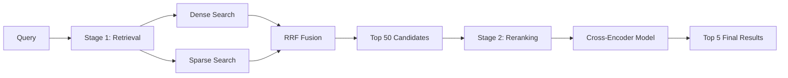

# Section 5: Hybrid Search (Precision + Meaning)

This section represents the state-of-the-art in production search systems. We combine the "brain" (semantic vectors) with the "eyes" (keyword matching) for optimal results.

---

## Topic 1: Dense vs. Sparse Vectors (The Dual System)

### 1. The "How" (Theory)

**Dense Vectors (Semantic Embeddings)**:
*   **Definition**: Fixed-size arrays where EVERY dimension has a value.
*   **Size**: Typically 384-1536 dimensions
*   **Generation**: Neural network (Transformers)
*   **Example**:
    ```python
    from sentence_transformers import SentenceTransformer
    
    model = SentenceTransformer('all-MiniLM-L6-v2')
    text = "The cat sat on the mat"
    dense_vector = model.encode(text)
    
    print(dense_vector.shape)  # (384,)
    print(dense_vector[:5])    # [0.023, -0.891, 0.445, -0.234, 0.102]
    # All 384 positions have values
    ```

**Sparse Vectors (Keyword-Based)**:
*   **Definition**: Very large arrays where MOST dimensions are zero.
*   **Size**: Typically 30,000+ dimensions (vocabulary size)
*   **Generation**: Statistical methods (BM25) or learned (SPLADE)
*   **Example**:
    ```python
    # Conceptual representation
    vocab_size = 30000
    sparse_vector = [0.0] * vocab_size
    
    # Only activate dimensions for words present in text
    sparse_vector[vocab["cat"]] = 2.5
    sparse_vector[vocab["sat"]] = 1.8
    sparse_vector[vocab["mat"]] = 1.2
    
    # Efficient storage: Only store non-zero values
    sparse_vector_compressed = [
        (452, 2.5),   # index 452 = "cat"
        (1023, 1.8),  # index 1023 = "sat"
        (8901, 1.2)   # index 8901 = "mat"
    ]
    # 3 values instead of 30,000!
    ```

**Visual Comparison**:
```
Dense Vector (384D):
[0.02, -0.89, 0.45, -0.23, 0.10, 0.67, -0.34, ...]
 ↑     ↑      ↑      ↑      ↑      ↑      ↑
 All positions filled

Sparse Vector (30,000D):
[0, 0, 0, ..., 2.5, 0, 0, ..., 1.8, 0, 0, ..., 1.2, ...]
              ↑ 452         ↑ 1023         ↑ 8901
              Only 3 non-zero values out of 30,000
```

### 2. The "Why" (Context)

**When Dense Fails**:
```python
# Query
query = "Error code ERR-505 troubleshooting"

# Dense vector sees "error", "code", "troubleshooting" as concepts
# It might match:
# - "Error code ERR-404 troubleshooting" (Score: 0.85)
# - "General troubleshooting guide" (Score: 0.78)
# - "Error code ERR-505 troubleshooting" (Score: 0.82) ← Should be #1!

# Why? To the AI, "404" and "505" are semantically similar (both error codes)
```

**When Sparse Succeeds**:
```python
# Sparse vector looks for EXACT token "ERR-505"
# Matches:
# - "Error code ERR-505 troubleshooting" (Has exact token!) ← Perfect match
# - "ERR-505 documentation" (Has exact token!)
# - "Error code ERR-404" (No "505" token) ← Excluded

# Precision: 100% on the specific code
```

**The Complementary Nature**:

| Scenario | Dense (Semantic) | Sparse (Keyword) | Winner |
| :--- | :--- | :--- | :--- |
| "I love dogs" vs "I adore canines" | ✅ High match (synonyms) | ❌ Zero overlap | Dense |
| "iPhone 15" vs "iPhone 14" | 😐 Nearly identical | ✅ Distinct tokens | Sparse |
| "Fix my car" vs "Automobile repair" | ✅ Understands intent | ❌ Different words | Dense |
| "SKU-12345" vs "SKU-12346" | 😐 Random strings | ✅ Exact match | Sparse |

### 3. The "Aha!" Moment 💡
> **"Dense for Exploration; Sparse for Precision."**

**The Insight**:
*   **Dense**: "Show me things LIKE this" (vibe, meaning, concept)
*   **Sparse**: "Show me things EXACTLY like this" (specific terms, IDs, rare words)

When you combine both, you get Google-quality search.

---

## Topic 2: Sparse Embeddings (SPLADE & BM25)

### 1. The "How" (Theory)

**BM25 (Classic Approach)**:
*   **Algorithm**: Statistical word importance
*   **Formula**:
    $$
    \text{score}(Q, D) = \sum_{i=1}^{n} \text{IDF}(q_i) \cdot \frac{f(q_i, D) \cdot (k_1 + 1)}{f(q_i, D) + k_1 \cdot (1 - b + b \cdot \frac{|D|}{\text{avgdl}})}
    $$
    *   `IDF(qi)` = Inverse Document Frequency (rare words score higher)
    *   `f(qi, D)` = Frequency of query term in document
    *   `k1`, `b` = Tuning parameters
    *   `|D|` = Document length
    *   `avgdl` = Average document length

**Simplified Example**:
```python
from rank_bm25 import BM25Okapi

corpus = [
    "The cat sat on the mat",
    "The dog sat on the log",
    "Cats and dogs are great pets"
]

# Tokenize
tokenized_corpus = [doc.split() for doc in corpus]

# Create BM25 index
bm25 = BM25Okapi(tokenized_corpus)

# Query
query = "cat pet"
tokenized_query = query.split()

# Get scores
scores = bm25.get_scores(tokenized_query)
print(scores)
# [2.19, 0.0, 1.54]
# Doc 1: High (has "cat")
# Doc 2: Zero (no matching words)
# Doc 3: Medium (has "pet")
```

**SPLADE (Learned Sparse Embeddings)**:
*   **Full Name**: Sparse Lexical and Expansion Model
*   **Innovation**: Uses a neural network to predict BOTH:
    1.  Words present in the document
    2.  **Expansion words** (related terms that SHOULD match)

**Example**:
```python
# Input text
text = "My car won't start"

# Traditional sparse (BM25):
# Activates: ["car", "won't", "start"]

# SPLADE sparse:
# Activates: ["car", "won't", "start", "engine", "battery", "ignition", "vehicle"]
#           ↑ Original            ↑ Expansion (predicted by neural network)
```

**The Network Architecture**:
```
Input: "My car won't start"
  ↓
BERT Encoder (contextual understanding)
  ↓
Linear Layer + ReLU (predict importance for EACH word in vocabulary)
  ↓
Output: Sparse vector (30,000D)
  [0, 0, 0, ..., 2.5(car), 0, 1.8(engine), 0, 0, ..., 1.5(battery), ...]
```

**Code Example**:
```python
from transformers import AutoModelForMaskedLM, AutoTokenizer
import torch

# Load SPLADE model
model_id = "naver/splade-cocondenser-ensembledistil"
tokenizer = AutoTokenizer.from_pretrained(model_id)
model = AutoModelForMaskedLM.from_pretrained(model_id)

def encode_splade(text):
    tokens = tokenizer(text, return_tensors="pt")
    output = model(**tokens).logits
    
    # Apply ReLU and max pooling
    vec = torch.max(
        torch.log(1 + torch.relu(output)) * tokens.attention_mask.unsqueeze(-1),
        dim=1
    )[0].squeeze()
    
    return vec

# Generate sparse embedding
sparse_vec = encode_splade("My car won't start")

# Get non-zero indices (activated words)
non_zero = torch.nonzero(sparse_vec).squeeze()
for idx in non_zero[:10]:  # Top 10 activated tokens
    token = tokenizer.decode([idx])
    score = sparse_vec[idx].item()
    print(f"{token}: {score:.2f}")

# Output:
# car: 2.45
# start: 2.31
# engine: 1.82  ← Expansion!
# vehicle: 1.65  ← Expansion!
# battery: 1.43  ← Expansion!
# ignition: 1.21  ← Expansion!
```

### 2. The "Why" (Context)

**Why SPLADE > BM25?**

**Scenario: Medical Search**
```python
# Query
query = "My head hurts"

# BM25 sparse:
# Activates: ["head", "hurts"]
# Finds documents with "head" and "hurts" only

# SPLADE sparse:
# Activates: ["head", "hurts", "headache", "migraine", "pain", "cranial"]
# Finds documents about headaches even if they use medical terminology

# Result: SPLADE has better recall (finds more relevant docs)
```

**The Trade-off**:
*   **BM25**: Faster, simpler, exact keyword matching
*   **SPLADE**: Slower, more complex, learned expansion = better recall

---

## Topic 3: Hybrid Querying (The Fusion Algorithm)

### 1. The "How" (Theory)

**The Challenge**: Combining incompatible scores

```python
# Problem
dense_results = [
    {"id": 1, "score": 0.95},  # Cosine similarity [0, 1]
    {"id": 2, "score": 0.87},
    {"id": 3, "score": 0.82}
]

sparse_results = [
    {"id": 3, "score": 12.5},  # BM25 score [0, ∞]
    {"id": 1, "score": 8.2},
    {"id": 5, "score": 6.7}
]

# Can't just add: 0.95 + 12.5 = meaningless!
```

**Solution 1: Normalization** (naive):
```python
# Normalize both to [0, 1]
def normalize(scores):
    min_s, max_s = min(scores), max(scores)
    return [(s - min_s) / (max_s - min_s) for s in scores]

# Then average
final_score = 0.5 * dense_normalized + 0.5 * sparse_normalized
```

**Solution 2: Reciprocal Rank Fusion (RRF)** (industry standard):

**Formula**:
$$
\text{RRF}(d) = \sum_{r \in R} \frac{1}{k + r(d)}
$$

Where:
*   `d` = document
*   `R` = set of rankings (dense, sparse, etc.)
*   `r(d)` = rank of document d in ranking r
*   `k` = constant (typically 60)

**Code Implementation**:
```python
def reciprocal_rank_fusion(search_results_dict, k=60):
    """
    search_results_dict = {
        "dense": [(id1, score1), (id2, score2), ...],
        "sparse": [(id3, score3), (id1, score4), ...]
    }
    """
    fused_scores = {}
    
    for system_name, results in search_results_dict.items():
        for rank, (doc_id, score) in enumerate(results, start=1):
            if doc_id not in fused_scores:
                fused_scores[doc_id] = 0
            
            # Add RRF score
            fused_scores[doc_id] += 1 / (k + rank)
    
    # Sort by fused score
    sorted_results = sorted(
        fused_scores.items(),
        key=lambda x: x[1],
        reverse=True
    )
    
    return sorted_results

# Example
dense = [(1, 0.95), (2, 0.87), (3, 0.82), (4, 0.75)]
sparse = [(3, 12.5), (1, 8.2), (5, 6.7), (6, 5.3)]

results = reciprocal_rank_fusion({
    "dense": dense,
    "sparse": sparse
}, k=60)

print(results)
# Output:
# [(1, 0.0328),  ← Rank 1 in dense + Rank 2 in sparse = 1/61 + 1/62
#  (3, 0.0312),  ← Rank 3 in dense + Rank 1 in sparse = 1/63 + 1/61
#  (2, 0.0161),  ← Rank 2 in dense only
#  (5, 0.0156),  ← Rank 3 in sparse only
#  ...]
```

**Why RRF Works**:
1.  **Scale-free**: Doesn't matter if scores are [0,1] or [0,100]
2.  **Position-based**: Cares about ranking, not magnitude
3.  **Robust**: If a doc is #1 in both systems, it gets a huge boost
4.  **Simple**: No hyperparameters to tune (k=60 works well empirically)

### 2. The "Why" (Context)

**Real-World Example**:

```python
# Query: "python programming tutorial"

# Dense vector search
# - Finds "Learn Python Programming" (0.92)
# - Finds "Coding in Python" (0.87)
# - Finds "Programming Guide" (0.83) ← Misses "Python"!

# Sparse keyword search
# - Finds "Python Tutorial PDF" (exact keywords!)
# - Finds "Advanced Python Programming"
# - Misses "Coding in Python" (no "Python" in title)

# RRF Fusion
# - "Learn Python Programming" appears in both → Top rank
# - "Python Tutorial PDF" appears in sparse → High rank
# - "Coding in Python" appears in dense → Medium rank
# - Best of both worlds!
```

### 3. The "Aha!" Moment 💡
> **"It's not Magic; it's Engineering."**

**The Realization**:
You don't have to choose between "AI Search" and "Keyword Search". You run both and combine intelligently. This is how Google, Bing, and modern search engines work.

---

## Topic 4: Reranking (The Final Polish)

### 1. The "How" (Theory)

**The Two-Stage Pipeline**:



**Stage 1: Retrieval (Fast, Approximate)**:
*   **Goal**: Narrow down 1M documents to 50 candidates
*   **Method**: Bi-encoder (separate embeddings for query and docs)
*   **Speed**: 10ms
*   **Accuracy**: 90-95%

**Stage 2: Reranking (Slow, Precise)**:
*   **Goal**: Perfectly rank the top 50
*   **Method**: Cross-encoder (jointly process query + document)
*   **Speed**: 500ms
*   **Accuracy**: 98-99%

**Bi-Encoder vs Cross-Encoder**:

```python
# Bi-Encoder (used in retrieval)
query_vec = model.encode("cat")        # [0.1, 0.9, ...]
doc_vec = model.encode("feline pet")   # [0.11, 0.88, ...]
similarity = cosine(query_vec, doc_vec)

# Encoded separately → Can precompute all docs → Fast search

# ----------------------------------------

# Cross-Encoder (used in reranking)
score = model.predict([("cat", "feline pet")])
# Returns: 0.94 (relevance score)

# Query + Doc encoded TOGETHER → Cannot precompute → Slow, but accurate
```

**Code Example**:
```python
from sentence_transformers import CrossEncoder

# Load reranker model
reranker = CrossEncoder('cross-encoder/ms-marco-MiniLM-L-6-v2')

# Stage 1: Get candidates from hybrid search
candidates = hybrid_search(query, limit=50)

# Stage 2: Rerank
query_doc_pairs = [
    (query, candidate.payload['text'])
    for candidate in candidates
]

# Get cross-encoder scores
rerank_scores = reranker.predict(query_doc_pairs)

# Combine with original candidates
reranked_results = [
    (candidates[i], rerank_scores[i])
    for i in range(len(candidates))
]

# Sort by rerank score
reranked_results.sort(key=lambda x: x[1], reverse=True)

# Return top 5
final_results = reranked_results[:5]

for candidate, score in final_results:
    print(f"Rerank Score: {score:.3f}")
    print(f"Text: {candidate.payload['text']}")
    print("---")
```

### 2. The "Why" (Context)

**When Reranking Helps**:

```python
# Query: "How to fix WiFi not working on iPhone?"

# After Stage 1 (Hybrid Search) - Top 5:
# 1. "How to fix WiFi on Android" (0.87) ← Wrong device!
# 2. "How to fix Bluetooth on iPhone" (0.85) ← Wrong feature!
# 3. "How to fix WiFi not working on iPhone" (0.83) ← Perfect!
# 4. "iPhone WiFi troubleshooting guide" (0.81)
# 5. "Common iPhone connectivity issues" (0.79)

# After Stage 2 (Reranking) - Top 5:
# 1. "How to fix WiFi not working on iPhone" (0.96) ← Now #1!
# 2. "iPhone WiFi troubleshooting guide" (0.93)
# 3. "Common iPhone connectivity issues" (0.88)
# 4. "How to fix Bluetooth on iPhone" (0.45) ← Dropped!
# 5. "How to fix WiFi on Android" (0.38) ← Dropped!
```

**Why Cross-Encoder is Better**:
*   **Attention**: The model can see "WiFi" in context with "iPhone" together
*   **No Independence Assumption**: Bi-encoders treat query/doc separately; cross-encoders see interactions
*   **Example**: Cross-encoder understands "not" negates "working", bi-encoder might miss it

**The Trade-off**:
```python
# Bi-Encoder: 1M docs × 1 query
# Time: 10ms (all docs pre-encoded, just cosine similarity)

# Cross-Encoder: 1M docs × 1 query
# Time: 1M × 50ms = 50,000 seconds = 13.9 hours! (must encode each pair)

# Solution: Use cross-encoder only on top 50 → 50 × 50ms = 2.5 seconds
```

---

## 🚀 Advanced Topic: ColBERT (Late Interaction)
*(Deep Dive for Section 5)*

### The Problem

**Bi-Encoders**: Fast but lose detail (compress entire doc to one vector)
**Cross-Encoders**: Accurate but slow (must process every pair)

**Can we get the best of both?**

### ColBERT Architecture

**Full Name**: Contextualized Late Interaction over BERT

**Key Innovation**: Keep one vector PER TOKEN, not one vector per document

```python
# Traditional Bi-Encoder
doc = "The cat sat on the mat"
doc_vector = model.encode(doc)  # [0.1, 0.9, ...] (384D, single vector)

# ColBERT
doc = "The cat sat on the mat"
token_vectors = colbert.encode(doc)
# [
#   [0.1, 0.9, ...],  # "The"
#   [0.2, 0.8, ...],  # "cat"
#   [0.3, 0.7, ...],  # "sat"
#   [0.4, 0.6, ...],  # "on"
#   [0.5, 0.5, ...],  # "the"
#   [0.6, 0.4, ...]   # "mat"
# ]
# Shape: (6 tokens, 384D)
```

**The Search (MaxSim)**:
```python
# Query
query = "cat"
query_token_vectors = colbert.encode(query)  # [(1, 384)]

# For each query token, find max similarity with ANY doc token
def maxsim(query_tokens, doc_tokens):
    total_score = 0
    for q_vec in query_tokens:
        # Find most similar doc token
        max_similarity = max([
            cosine(q_vec, d_vec) for d_vec in doc_tokens
        ])
        total_score += max_similarity
    return total_score

score = maxsim(query_token_vectors, doc_token_vectors)
# The word "cat" in query matches "cat" in doc → High score
```

**Why It's Fast**:
*   **Pre-computation**: All document token vectors are computed offline
*   **Pruning**: Use approximate nearest neighbor to find candidate docs first
*   **Late Interaction**: Only compute MaxSim for top 1000 candidates

**Performance**:
*   **Bi-Encoder**: 10ms, 90% accuracy
*   **ColBERT**: 50ms, 97% accuracy
*   **Cross-Encoder**: 2500ms, 99% accuracy

**Use Case**:
ColBERT is perfect for:
*   Scientific search (need exact term matching)
*   Legal search (specific clauses matter)
*   Code search (function names, variable names)

This is the bleeding edge of retrieval research!
