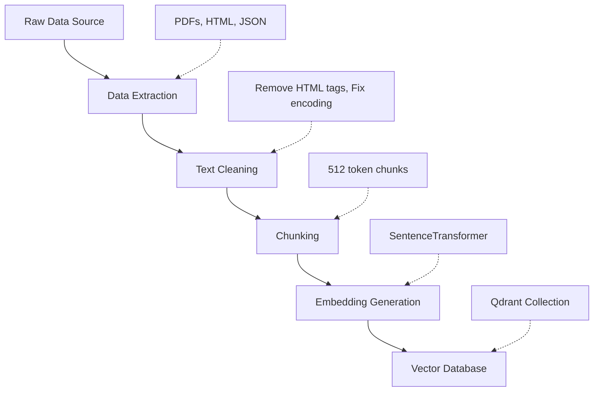

# Section 3: Semantic Search (The Brain)

This section introduces the "AI" into our system. We move from manually creating vectors to letting trained neural networks generate them automatically.

---

## Topic 1: Embeddings (The AI Model)

### 1. The "How" (Theory)

An **Embedding Model** is a function that converts arbitrary text into a fixed-size vector.

**Mathematical Representation**:
```
f: Text → ℝⁿ
f("I love cats") → [0.023, -0.891, 0.445, ..., 0.102] ∈ ℝ³⁸⁴
```

**The Architecture (Transformer Models)**:

```
Input Text: "The cat sat on the mat"
     ↓
[1] Tokenization
     "The" → 1524
     "cat" → 2891
     "sat" → 7734
     ... → [1524, 2891, 7734, 2156, 1996, 4329]
     ↓
[2] Token Embeddings (Lookup Table)
     1524 → [0.1, 0.2, ..., 0.5] (768D)
     2891 → [0.3, 0.1, ..., 0.8] (768D)
     ... (6 tokens × 768D each)
     ↓
[3] Transformer Layers (Self-Attention)
     Each token "looks" at all other tokens
     "cat" understands it's the subject
     "sat" understands it's the action
     ↓
[4] Pooling (Mean/CLS Token)
     Average all 6 token vectors into 1 vector
     OR use the [CLS] token's final state
     ↓
[5] Final Embedding
     [0.023, -0.891, ..., 0.102] (384D)
```

**Popular Models**:

| Model | Dimensions | Size | Speed | Use Case |
| :--- | :--- | :--- | :--- | :--- |
| `all-MiniLM-L6-v2` | 384 | 23 MB | Fast | General purpose |
| `all-mpnet-base-v2` | 768 | 420 MB | Medium | Higher quality |
| `text-embedding-3-small` (OpenAI) | 1536 | N/A (API) | API call | Production |
| `e5-large-v2` | 1024 | 1.3 GB | Slow | Research |

**Code Example**:
```python
from sentence_transformers import SentenceTransformer

# Load model (downloads ~23MB first time)
model = SentenceTransformer('all-MiniLM-L6-v2')

# Generate embeddings
sentences = [
    "I love cats",
    "I adore felines",
    "I enjoy programming"
]

embeddings = model.encode(sentences)
print(embeddings.shape)  # (3, 384)

# Check similarity
from sklearn.metrics.pairwise import cosine_similarity
print(cosine_similarity([embeddings[0]], [embeddings[1]]))  # 0.78 (high)
print(cosine_similarity([embeddings[0]], [embeddings[2]]))  # 0.12 (low)
```

### 2. The "Why" (Context)

**Why Can't We Use Rules?**

Imagine trying to write code for language understanding:
```python
# This approach is doomed to fail
if "cat" in text or "feline" in text or "kitty" in text:
    category = "animals"
if "not" in text:
    negate(category)  # How??
if "sarcasm" in text:
    invert(meaning)  # Impossible!
```

**The Complexity**:
*   **Synonyms**: 100+ words for "good" (excellent, great, superb, ...).
*   **Negation**: "not bad" = good.
*   **Context**: "That's sick!" (could be negative or positive slang).
*   **Sarcasm**: "Oh great, another meeting" (negative sentiment, positive words).

**The AI Solution**:
Train on billions of sentences. The model learns:
*   "cat" and "feline" appear in similar contexts → Similar vectors.
*   "not good" appears near "bad" in training data → Similar vectors.
*   "sick" near "cool" in youth slang → Context-dependent vector.

### 3. The "Aha!" Moment 💡
> **"The AI doesn't follow rules; it recognizes patterns from experience."**

Just like a human child learns language by exposure (not grammar rules), the model learns by reading millions of examples.

**The Realization**:
When you see the model correctly match "automobile" to "car" without being explicitly told they're synonyms, you understand it has internalized the structure of language.

---

## Topic 2: Ingestion Pipelines (From Raw Data to Vectors)

### 1. The "How" (Architecture)

**The Full Pipeline**:



**Step-by-Step Breakdown**:

**Step 1: Data Extraction**
```python
import json

# Example: airline policy JSON
with open('airline_policy_dataset.json', 'r') as f:
    documents = json.load(f)

# documents = [
#     {"id": 1, "text": "Baggage allowance is 23kg...", "category": "baggage"},
#     {"id": 2, "text": "Cancellation within 24 hours...", "category": "cancellation"},
#     ...
# ]
```

**Step 2: Text Cleaning**
```python
import re

def clean_text(text):
    # Remove HTML tags
    text = re.sub(r'<[^>]+>', '', text)
    
    # Remove extra whitespace
    text = re.sub(r'\s+', ' ', text)
    
    # Remove special characters (optional)
    text = re.sub(r'[^\w\s.,!?-]', '', text)
    
    # Normalize
    text = text.strip().lower()
    
    return text

cleaned = [clean_text(doc['text']) for doc in documents]
```

**Step 3: Chunking (Critical for Long Documents)**
```python
from langchain.text_splitter import RecursiveCharacterTextSplitter

def chunk_text(text, chunk_size=500, overlap=50):
    """
    Split text into overlapping chunks
    
    Why overlap? So semantic continuity isn't lost at boundaries.
    Example:
      Chunk 1: "...The baggage limit is 23kg."
      Chunk 2: "The baggage limit is 23kg. For business class..."
                ^^^^^^^^^^^^^^^^^^^^^^^^ (overlap ensures context)
    """
    splitter = RecursiveCharacterTextSplitter(
        chunk_size=chunk_size,
        chunk_overlap=overlap,
        separators=["\n\n", "\n", ". ", " ", ""]
    )
    return splitter.split_text(text)

# Example
long_text = "..." * 5000  # 5000 chars
chunks = chunk_text(long_text)
print(f"Split into {len(chunks)} chunks")
# Output: Split into 12 chunks
```

**Why Chunking Matters**:
*   **Model Limits**: Most models have a max token limit (512 for MiniLM).
*   **Semantic Density**: A 50-page PDF embedded as one vector loses detail. You need granular chunks.
*   **Retrieval Precision**: You want to return the relevant paragraph, not the entire book.

**Step 4: Embedding Generation**
```python
from sentence_transformers import SentenceTransformer

model = SentenceTransformer('all-MiniLM-L6-v2')

# Batch encoding (efficient)
chunks = ["Chunk 1 text...", "Chunk 2 text...", ...]
embeddings = model.encode(
    chunks,
    batch_size=32,  # Process 32 at a time
    show_progress_bar=True
)

print(embeddings.shape)  # (num_chunks, 384)
```

**Step 5: Indexing in Qdrant**
```python
from qdrant_client import QdrantClient
from qdrant_client.models import PointStruct, VectorParams, Distance

client = QdrantClient(":memory:")

# Create collection
client.create_collection(
    collection_name="airline_policies",
    vectors_config=VectorParams(size=384, distance=Distance.COSINE)
)

# Prepare points
points = []
for idx, (chunk, embedding) in enumerate(zip(chunks, embeddings)):
    points.append(PointStruct(
        id=idx,
        vector=embedding.tolist(),
        payload={
            "text": chunk,
            "source_doc": documents[idx // 10]["id"],  # Original doc ID
            "chunk_index": idx % 10
        }
    ))

# Batch upload
client.upsert(collection_name="airline_policies", points=points)
print(f"Indexed {len(points)} chunks")
```

### 2. The "Why" (Context)

**Why Not Embed the Whole Document?**

**Experiment**:
```python
# Bad approach
entire_book = open('war_and_peace.txt').read()  # 587,287 words
vector = model.encode(entire_book)  # Truncates to first 512 tokens!

# Good approach
chunks = chunk_text(entire_book, chunk_size=500)  # 2,349 chunks
vectors = model.encode(chunks)  # Each chunk fully embedded
```

**The Problem with Whole-Document Embeddings**:
1.  **Information Loss**: Model only sees first 512 tokens, ignores the rest.
2.  **Semantic Dilution**: Mixing "Chapter 1: Peace" and "Chapter 100: War" into one vector averages them out (meaningless).
3.  **Poor Retrieval**: User asks about "Napoleon's retreat". You return the whole book instead of the relevant chapter.

**The Chunking Strategy**:
*   **Small Chunks (250 words)**: Precise, but might split a concept across boundaries.
*   **Large Chunks (1000 words)**: Captures context, but less precise.
*   **Optimal (500 words + 50 overlap)**: Balance between precision and context.

---

## Topic 3: Semantic Search (The Query Workflow)

### 1. The "How" (Mechanism)

**The Complete Search Flow**:

```python
# Step 1: User submits query
user_query = "What if I lose my luggage?"

# Step 2: Embed the query (using SAME model as indexing)
query_vector = model.encode(user_query)

# Step 3: Search Qdrant
results = client.search(
    collection_name="airline_policies",
    query_vector=query_vector.tolist(),
    limit=5
)

# Step 4: Display results
for result in results:
    print(f"Score: {result.score:.3f}")
    print(f"Text: {result.payload['text']}")
    print("---")
```

**Example Output**:
```
Score: 0.872
Text: If your baggage is lost, report it immediately at the baggage claim desk. We will track your luggage and deliver it to your address within 48 hours.
---
Score: 0.834
Text: Lost baggage claims must be filed within 24 hours. Compensation is provided for essential items purchased during the delay.
---
Score: 0.791
Text: For damaged or delayed baggage, please fill out the incident report form...
---
```

**Why These Matched (Semantic Overlap)**:

| User Query | Document | Shared Keywords | Shared Meaning |
| :--- | :--- | :--- | :--- |
| "lose my luggage" | "baggage is lost" | ❌ 0 words | ✅ 100% (same concept) |
| "What if" | "report immediately" | ❌ 0 words | ✅ Both about "procedure" |

The model understands:
*   "luggage" = "baggage"
*   "lose" = "lost"
*   "What if" = question about procedures

### 2. The "Why" (Context)

**The Keyword Search Failure**:

```sql
-- Traditional search
SELECT * FROM policies 
WHERE text LIKE '%lose%' OR text LIKE '%luggage%';

-- Returns: 0 results
-- Why? Document says "lost" and "baggage" (different words!)
```

**The Semantic Search Success**:
```python
# Vector search
query = "lose luggage"
# Vector: [0.23, 0.89, -0.45, ...]

database_vectors = [
    [0.24, 0.87, -0.44, ...],  # "lost baggage" ← 0.98 similarity!
    [0.91, -0.23, 0.55, ...],  # "flight delay" ← 0.12 similarity
]
```

The vectors for "lose luggage" and "lost baggage" are nearly identical because the model learned they're synonyms.

### 3. The "Aha!" Moment 💡
> **"The AI bridges the vocabulary gap."**

**The Insight**:
When you search "I hurt my leg" and get back "Orthopedic Clinic" as the top result (even though they share zero words), you realize the model has learned:
*   "hurt" → "injury" → "medical"
*   "leg" → "orthopedic"
*   The connection exists in vector space.

---

## Topic 4: Limitations of Semantic Search (The Trap)

### 1. The "How" (Failure Modes)

**Problem 1: Over-Generalization**

```python
# User query
query = "Baggage policy for Economy class"
query_vector = model.encode(query)

# Two documents in database
doc1 = "Baggage allowance for Economy: 23kg"
doc2 = "Baggage allowance for Business: 32kg"

vec1 = model.encode(doc1)  # [0.81, 0.65, ...]
vec2 = model.encode(doc2)  # [0.82, 0.64, ...]

# Similarity scores
similarity(query_vector, vec1) = 0.913
similarity(query_vector, vec2) = 0.908  # Only 0.5% difference!
```

**The Issue**:
The AI sees:
*   Both docs mention "Baggage allowance"
*   Both mention a cabin class
*   Both mention a weight

The only difference is "Economy" vs "Business" (one word out of 5). The vectors are nearly identical.

**Problem 2: Missing Factual Constraints**

```python
# Query
"Best restaurants in Dubai"

# Results
1. "Top 10 Restaurants in Dubai" (Score: 0.95) ✅ Correct
2. "Best Restaurants in New York" (Score: 0.89) ❌ Wrong city!
3. "Dubai Food Scene Overview" (Score: 0.85) ✅ Relevant
```

The model thinks "Best Restaurants" (concept) is the primary signal. "Dubai" vs "New York" is just one word difference.

**Problem 3: Temporal Sensitivity**

```python
# Query
"iPhone 15 features"

# Semantic match
"iPhone 14 features" (Score: 0.94)  # Wrong version!
```

To the AI, "14" and "15" are both just numbers. The semantic difference is minimal.

### 2. The "Why" (Context)

**Why Does This Happen?**

**Root Cause**: Embedding models optimize for **conceptual similarity**, not **factual precision**.

**The Training Objective**:
During training, the model learns:
```
"I love dogs" ≈ "I adore canines" (maximize similarity)
"I love dogs" ≠ "I hate cats" (minimize similarity)
```

It does NOT learn:
```
"Economy baggage: 23kg" ≠ "Business baggage: 32kg"
```

Because to the model, both sentences are about baggage policies (same concept).

**The Implication**:
Pure semantic search is like asking a friend with amnesia:
*   Friend: "I remember you talked about luggage!"
*   You: "Yes, but was it Economy or Business?"
*   Friend: "Uhhh... something about luggage!" (Not helpful)

### 3. The "Aha!" Moment 💡
> **"Semantic search is a 'Vibe Check', not a 'Fact Check'."**

**The Realization**:
When you see relevant-but-wrong results (right topic, wrong details), you understand that:
*   The AI captured the **theme** correctly.
*   But it ignored the **constraints**.

This is why we need **Section 4: Metadata Filtering** to add structured filters on top of semantic search.

---

## 🚀 Advanced Topic: Multilingual Embeddings
*(Deep Dive for Section 3)*

### The Magic of Cross-Lingual Models

**The Problem**:
Standard models are language-locked:
```python
model = SentenceTransformer('all-MiniLM-L6-v2')  # English-only

vec_en = model.encode("Hello")
vec_es = model.encode("Hola")

similarity(vec_en, vec_es) = 0.23  # Low! Different languages
```

**The Solution: Multilingual Models**
```python
model = SentenceTransformer('paraphrase-multilingual-MiniLM-L12-v2')

vec_en = model.encode("Hello")
vec_es = model.encode("Hola")
vec_fr = model.encode("Bonjour")

similarity(vec_en, vec_es) = 0.91  # High! Same meaning
similarity(vec_en, vec_fr) = 0.89  # High!
```

### How It Works

**Training Strategy (Parallel Corpora)**:
1.  **Data**: UN documents translated into 100+ languages.
    *   English: "The meeting will start at 2pm."
    *   Spanish: "La reunión comenzará a las 2pm."
    *   Chinese: "会议将在下午2点开始。"
2.  **Objective**: Force all 3 sentences to have the same vector.
3.  **Result**: The model learns a "Universal Concept Space" where meaning transcends language.

**Architecture**:
```
English  → [Encoder] → [0.5, 0.3, 0.9, ...] ← Shared space
Spanish  → [Encoder] → [0.51, 0.29, 0.88, ...] ← Same vector!
Chinese  → [Encoder] → [0.49, 0.31, 0.91, ...] ← Same vector!
```

### Real-World Example

**Use Case: International Customer Support**

```python
# Knowledge base (mixed languages)
docs = [
    "To reset your password, click 'Forgot Password'",  # English
    "Pour réinitialiser votre mot de passe, cliquez sur 'Mot de passe oublié'",  # French
    "パスワードをリセットするには、「パスワードを忘れた」をクリックしてください"  # Japanese
]

docs_vectors = model.encode(docs)

# User query (Spanish)
query = "¿Cómo cambio mi contraseña?"  # How do I change my password?
query_vector = model.encode(query)

# Search
similarities = cosine_similarity([query_vector], docs_vectors)[0]
# [0.87, 0.89, 0.86]  # All high! Language doesn't matter
```

**The Result**:
You can build ONE search system that works across 100+ languages without translating everything to English first.

### Advanced: Language-Specific Fine-Tuning

**The Trade-off**:
*   **Multilingual models**: Work across languages, but slightly worse per-language accuracy.
*   **Monolingual models**: Best for single language, useless for others.

**Best Practice**:
*   **Global app**: Use multilingual (`paraphrase-multilingual-MiniLM`).
*   **English-only app**: Use monolingual (`all-MiniLM-L6-v2`) for 10% better accuracy.

### The Limitation

**Code-Switching**:
```python
query = "Me gusta programming en Python"  # Spanish + English

# The model struggles with mixed languages within one sentence
# Best practice: Detect language, split, embed separately
```

This is the cutting edge of NLP research. Models like GPT-4 handle code-switching better, but embedding models still have challenges.
