# Section 4: Metadata Filtering

This section transforms our search from a "Vibe Check" into a precise "Data Query" by adding structured constraints on top of semantic search.

---

## Topic 1: The Context Problem (Semantic Hallucination)

### 1. The "How" (Theory)

**The Core Issue**: Vectors capture meaning but ignore critical metadata constraints.

**Example Scenario**:
```python
# Two airline policies in the database
policy1 = {
    "text": "Baggage allowance is 23kg for checked luggage",
    "airline": "SkyStream",
    "class": "Economy"
}

policy2 = {
    "text": "Baggage allowance is 40kg for checked luggage",
    "airline": "SkyStream", 
    "class": "Business"
}

# Generate embeddings
vec1 = model.encode(policy1["text"])
# [0.82, 0.65, 0.91, -0.23, ...]

vec2 = model.encode(policy2["text"])
# [0.83, 0.64, 0.90, -0.22, ...]

# Calculate similarity
similarity = cosine_similarity([vec1], [vec2])[0][0]
print(f"Similarity: {similarity:.3f}")
# Output: Similarity: 0.987 (nearly identical!)
```

**Why They're Nearly Identical**:
*   Both mention "Baggage allowance"
*   Both mention "kg"
*   Both mention "checked luggage"
*   The ONLY difference is "23" vs "40" and "Economy" vs "Business"
*   To the AI, these are minor lexical variations, not semantic differences

### 2. The "Why" (Context)

**Real-World Failure Mode**:

```python
# User query
user_query = "What's the baggage limit for my Economy ticket?"
query_vector = model.encode(user_query)

# Search without filtering
results = client.search(
    collection_name="policies",
    query_vector=query_vector,
    limit=3
)

# Results (sorted by similarity)
# 1. Business Class baggage policy (0.912) ❌ WRONG!
# 2. First Class baggage policy (0.905) ❌ WRONG!
# 3. Economy Class baggage policy (0.903) ✅ Correct, but ranked #3!
```

**Why This Happens**:
The Business Class policy might mention more "premium" language that happens to align slightly better with the query vector due to random chance or the way the model was trained.

**The Consequence**:
*   **User Impact**: Customer gets wrong information (40kg instead of 23kg).
*   **Business Impact**: Customer shows up with excess baggage, gets charged surprise fees, leaves angry review.
*   **Trust Erosion**: "The chatbot gave me wrong information!"

### 3. The "Aha!" Moment 💡
> **"Without constraints, semantic search is guessing, not answering."**

**The Realization**:
When you see a system confidently return the "wrong right answer" (semantically similar but factually incorrect), you understand that:
*   The AI did its job (found similar text)
*   But it didn't understand the user's **context** (they bought an Economy ticket)

This is the moment you realize semantic search alone is insufficient for production systems.

---

## Topic 2: Metadata Filtering (The Fix)

### 1. The "How" (Architecture)

**The Hybrid Approach**: Combine soft (semantic) search with hard (boolean) filters.

**Data Structure**:
```python
from qdrant_client.models import PointStruct

# Each point has THREE components
point = PointStruct(
    id=1,
    vector=[0.82, 0.65, 0.91, ...],  # The semantic embedding (SOFT)
    payload={                         # The structured metadata (HARD)
        "text": "Baggage allowance is 23kg",
        "airline": "SkyStream",
        "class": "Economy",
        "category": "baggage",
        "last_updated": "2024-01-15",
        "policy_id": "BAG-ECO-001"
    }
)
```

**The Search Workflow**:

```mermaid
graph TD
    A[User Query] --> B[Extract Filters]
    A --> C[Generate Vector]
    B --> D[Pre-Filter Phase]
    C --> D
    D --> E[Reduced Candidate Set]
    E --> F[Vector Search Phase]
    F --> G[Ranked Results]
    
    B1["class=Economy"] -.-> B
    C1["embed(query)"] -.-> C
    D1["1M points → 10K points"] -.-> D
    F1["Search only 10K"] -.-> F
```



**Code Example**:
```python
from qdrant_client.models import Filter, FieldCondition, MatchValue

# User context
user_ticket_class = "Economy"
user_airline = "SkyStream"

# User query
user_question = "What's the baggage limit?"

# Step 1: Generate query vector
query_vector = model.encode(user_question)

# Step 2: Build filter
filter_condition = Filter(
    must=[
        FieldCondition(
            key="airline",
            match=MatchValue(value=user_airline)
        ),
        FieldCondition(
            key="class",
            match=MatchValue(value=user_ticket_class)
        )
    ]
)

# Step 3: Search with filter
results = client.search(
    collection_name="policies",
    query_vector=query_vector.tolist(),
    query_filter=filter_condition,
    limit=5
)

# Results now GUARANTEED to be Economy + SkyStream only!
for result in results:
    print(f"Score: {result.score:.3f}")
    print(f"Class: {result.payload['class']}")
    print(f"Text: {result.payload['text']}")
    print("---")
```

### 2. The "Why" (Context)

**The SQL Analogy**:

Traditional databases separate structure (schema) from search (queries):
```sql
SELECT * FROM policies
WHERE airline = 'SkyStream'   -- Hard constraint
  AND class = 'Economy'        -- Hard constraint
  AND text LIKE '%baggage%';   -- Soft search (inadequate)
```

Vector databases do the same, but with better "soft search":
```python
# Equivalent in vector DB
search(
    vector=embed("baggage"),     # Soft semantic search
    filter={
        "airline": "SkyStream",   # Hard constraint
        "class": "Economy"         # Hard constraint
    }
)
```

**Why This is Better**:
*   **Hard constraints** eliminate wrong answers (100% precision on filters).
*   **Soft search** finds the best remaining answer (semantic understanding).
*   **Result**: Precision AND recall.

### 3. The "Aha!" Moment 💡
> **"Filter First, Search Second."**

**The Insight**:
The order matters:
1.  **First**: Apply filters → Reduce 1M vectors to 10K candidates
2.  **Then**: Search the 10K vectors semantically

This is called **Pre-Filtering** and it guarantees 100% compliance with constraints while maintaining semantic intelligence.

---

## Topic 3: Filter Logic (The Syntax)

### 1. The "How" (Theory)

Qdrant uses a **declarative JSON syntax** inspired by MongoDB.

**The Three Operators**:

| Operator | Logic | SQL Equivalent | Use Case |
| :--- | :--- | :--- | :--- |
| `must` | AND | `WHERE a AND b` | Mandatory constraints |
| `should` | OR | `WHERE a OR b` | "At least one" conditions |
| `must_not` | NOT | `WHERE NOT a` | Exclusions |

**Example 1: Simple AND**
```python
from qdrant_client.models import Filter, FieldCondition, MatchValue

# Find policies for Economy class on SkyStream
filter1 = Filter(
    must=[
        FieldCondition(key="airline", match=MatchValue(value="SkyStream")),
        FieldCondition(key="class", match=MatchValue(value="Economy"))
    ]
)
# SQL: WHERE airline = 'SkyStream' AND class = 'Economy'
```

**Example 2: OR Logic**
```python
# Find policies for either Gold or Platinum members
filter2 = Filter(
    should=[
        FieldCondition(key="member_status", match=MatchValue(value="Gold")),
        FieldCondition(key="member_status", match=MatchValue(value="Platinum"))
    ]
)
# SQL: WHERE member_status = 'Gold' OR member_status = 'Platinum'
```

**Example 3: Exclusion (NOT)**
```python
# Find policies that are NOT expired
filter3 = Filter(
    must_not=[
        FieldCondition(key="status", match=MatchValue(value="expired"))
    ]
)
# SQL: WHERE status != 'expired'
```

**Example 4: Complex Boolean Logic**
```python
# Find policies for:
# - (United OR Delta) 
# - AND Economy
# - AND NOT expired

filter_complex = Filter(
    must=[
        FieldCondition(key="class", match=MatchValue(value="Economy"))
    ],
    should=[
        FieldCondition(key="airline", match=MatchValue(value="United")),
        FieldCondition(key="airline", match=MatchValue(value="Delta"))
    ],
    must_not=[
        FieldCondition(key="status", match=MatchValue(value="expired"))
    ]
)

# SQL equivalent:
# WHERE class = 'Economy'
#   AND (airline = 'United' OR airline = 'Delta')
#   AND status != 'expired'
```

**Example 5: Range Queries**
```python
from qdrant_client.models import Range

# Find policies updated in the last 30 days
from datetime import datetime, timedelta

cutoff_date = (datetime.now() - timedelta(days=30)).isoformat()

filter_range = Filter(
    must=[
        FieldCondition(
            key="last_updated",
            range=Range(gte=cutoff_date)  # Greater than or equal
        )
    ]
)
# SQL: WHERE last_updated >= '2024-12-11'
```

### 2. The "Why" (Context)

**When to Use Each**:

**Use `must` when**:
*   User's context is known (they bought Economy, not a choice)
*   Regulatory requirements (must be from approved list)
*   Data integrity (must have required fields)

**Use `should` when**:
*   Multiple valid options (show me Economy OR Business)
*   Fallback logic (prefer exact match, but similar is okay)
*   Boosting (prefer certain categories but don't exclude others)

**Use `must_not` when**:
*   Exclusions (don't show expired, deleted, or draft content)
*   Negative filters (exclude certain regions, languages, etc.)

**Real-World Example**:
```python
# Travel search: "Find flights to Europe, prefer direct, exclude budget airlines"

flight_filter = Filter(
    must=[
        FieldCondition(key="destination_continent", match=MatchValue(value="Europe"))
    ],
    should=[
        FieldCondition(key="stops", match=MatchValue(value=0))  # Prefer direct
    ],
    must_not=[
        FieldCondition(key="airline_type", match=MatchValue(value="budget"))
    ]
)
```

---

## Topic 4: Pre-Filtering vs Post-Filtering (The Performance Secret)

### 1. The "How" (Mechanism)

**Post-Filtering (Naive Approach)**:
```python
# Bad: Search first, filter later
results = client.search(query_vector, limit=100)  # Get 100 results
filtered = [r for r in results if r.payload['class'] == 'Economy'][:5]

# Problem: Might filter out all 100 results! Then you get 0 results.
# Waste: Searched 1M vectors, only to throw away the results.
```

**Pre-Filtering (Qdrant's Approach)**:
```python
# Good: Filter first, then search
results = client.search(
    query_vector=query_vector,
    query_filter=Filter(must=[...]),  # Applied BEFORE search
    limit=5
)

# Benefit: Only searches the valid subset
```

**The Implementation (Under the Hood)**:

```mermaid
graph TD
    A[1M Total Vectors] --> B{Filter Index Lookup}
    B -->|class=Economy| C[Bitmask: 10K IDs]
    C --> D[HNSW Graph Traversal]
    D -->|Only visit masked nodes| E[Top 5 Results]
    
    B1["Hash Map: Economy → [1,5,99,...]"] -.-> B
    D1["Skip Business/First Class nodes"] -.-> D
```



**Step-by-Step**:
1.  **Index Lookup**: Qdrant checks its payload index for `class=Economy`
    *   Result: List of IDs `[1, 5, 99, 234, 567, ...]` (10,000 IDs)
2.  **Bitmask Creation**: Create a binary mask `[1, 0, 0, 0, 1, ...]` (1 = valid, 0 = invalid)
3.  **HNSW Traversal**: When navigating the graph, ONLY visit nodes where mask = 1
4.  **Result**: Find Top 5 from the 10K subset, not the full 1M

**Performance Comparison**:
```python
import time

# Without filter (1M vectors)
start = time.time()
results = client.search(query_vector, limit=5)
print(f"No filter: {(time.time() - start)*1000:.2f}ms")
# Output: No filter: 15.23ms

# With pre-filter (reduces to 10K vectors)
start = time.time()
results = client.search(query_vector, query_filter=filter, limit=5)
print(f"With filter: {(time.time() - start)*1000:.2f}ms")
# Output: With filter: 2.87ms (5x faster!)
```

### 2. The "Why" (Context)

**Why is Pre-Filtering Faster?**

**HNSW Graph Structure**:
```
Full graph (1M nodes):
  - Must traverse ~log(1M) ≈ 20 hops
  - Each hop checks ~32 neighbors
  - Total comparisons: ~640

Filtered graph (10K nodes):
  - Must traverse ~log(10K) ≈ 13 hops
  - Each hop checks ~32 neighbors (but many skipped due to mask)
  - Total comparisons: ~200
```

**The Math**:
*   Filters reduce the search space by 99%
*   HNSW scales as O(log N)
*   log(1M) = 6, log(10K) = 4
*   Reduction: 6/4 = 1.5x speedup (plus fewer distance calculations)

### 3. The "Aha!" Moment 💡
> **"Filters turn a haystack into a handful."**

**The Realization**:
When you see filtering reduce search time from 15ms to 3ms while guaranteeing correctness, you understand why metadata filtering is non-negotiable in production.

---

## 🚀 Advanced Topic: Payload Indexing (The Speed Trap)
*(Deep Dive for Section 4)*

### The Problem

**Scenario**:
```python
# You add a filter
filter = Filter(must=[FieldCondition(key="user_id", match=MatchValue(value="user_12345"))])

# But search is SLOW (500ms instead of 5ms)
# Why?
```

**Root Cause**:
By default, payloads are stored on disk without indexes. To filter by `user_id`, Qdrant must:
1.  Load every payload from disk (1M reads)
2.  Parse the JSON
3.  Check if `user_id == "user_12345"`
4.  Build the bitmask

**Time Complexity**: O(N) where N = total vectors

### The Solution: Create Indexes

```python
# Create an index on the field you'll filter by
client.create_payload_index(
    collection_name="policies",
    field_name="user_id",
    field_schema="keyword"  # For exact string matching
)
```

**Now the Workflow**:
1.  Lookup `user_id` in hash map → Instant (O(1))
2.  Get bitmask directly
3.  Search

**Time Complexity**: O(1) for filter + O(log N) for search

### Index Types

| Field Type | Schema | Use Case | Example |
| :--- | :--- | :--- | :--- |
| **Keyword** | `keyword` | Exact string match | IDs, categories, status |
| **Integer** | `integer` | Range queries | Year, count, age |
| **Float** | `float` | Numeric ranges | Price, rating, distance |
| **Geo** | `geo` | Location radius | Lat/lon coordinates |
| **Text** | `text` | Full-text search | Not common (use vectors instead) |

**Example - Integer Index**:
```python
# Create index for range queries on year
client.create_payload_index(
    collection_name="policies",
    field_name="year",
    field_schema="integer"
)

# Now this is fast
filter = Filter(
    must=[
        FieldCondition(
            key="year",
            range=Range(gte=2020, lte=2024)
        )
    ]
)
```

### When to Create Indexes

**Best Practices**:
✅ **Index if**:
*   You filter by this field in >10% of queries
*   The field has high cardinality (many unique values)
*   You need sub-10ms latency

❌ **Don't index if**:
*   You never filter by this field
*   The field has 2-3 unique values (gender, boolean)
*   You only use it for display, not filtering

**Trade-offs**:
*   **Speed**: 10-100x faster filtering
*   **Memory**: Indexes consume RAM (~1-5% of payload size)
*   **Write Speed**: Slightly slower upserts (must update index)

### Advanced: Composite Indexes

**Problem**:
```python
# Filtering by TWO fields
filter = Filter(
    must=[
        FieldCondition(key="airline", match=MatchValue(value="SkyStream")),
        FieldCondition(key="class", match=MatchValue(value="Economy"))
    ]
)

# Even with individual indexes, this could be slow
# airline → 100K results
# class → 300K results
# Intersection → 10K results (but must compute intersection)
```

**Solution** (Upcoming feature in Qdrant):
```python
# Future API
client.create_composite_index(
    collection_name="policies",
    fields=["airline", "class"]
)

# This creates a combined index
# ("SkyStream", "Economy") → [1, 5, 99, ...]
```

This is the cutting edge of vector database optimization!
