# Section 6: Production Operations & Admin

This section is for the DevOps Engineer and SRE (Site Reliability Engineer). It's about keeping the system alive, fast, and resilient in production.

---

## Topic 1: Observability (Monitoring & Metrics)

### 1. The "How" (Theory)

**The Golden Signals** (adapted from Google SRE):

1.  **Latency**: How long does a request take?
2.  **Traffic**: How many requests per second?
3.  **Errors**: What's the error rate?
4.  **Saturation**: How "full" are the resources?

**Qdrant-Specific Metrics**:

```python
# Access metrics via HTTP API
import requests

response = requests.get("http://localhost:6333/metrics")
metrics = response.text

# Key metrics to watch:
# - app_info_collections_total: Number of collections
# - app_info_collections_vector_count: Vectors in each collection
# - app_status_recovery_mode: Is the system in recovery? (0 = no, 1 = yes)
# - grpc_req_duration_seconds: gRPC request latency
# - rest_req_duration_seconds: REST request latency
```

**Prometheus Integration**:
```yaml
# prometheus.yml
scrape_configs:
  - job_name: 'qdrant'
    static_configs:
      - targets: ['localhost:6333']
    metrics_path: '/metrics'
    scrape_interval: 15s
```

**Grafana Dashboard** (key panels):

| Panel | Metric | Alert Threshold |
| :--- | :--- | :--- |
| **Search Latency (p99)** | `grpc_req_duration_seconds{quantile="0.99"}` | > 100ms |
| **Memory Usage** | `process_resident_memory_bytes` | > 80% of available |
| **Index Status** | `qdrant_collection_status` | Yellow/Red |
| **QPS** | `rate(grpc_req_total[1m])` | Sudden 10x spike |
| **Error Rate** | `rate(grpc_req_total{status="error"}[5m])` | > 1% |

### 2. The "Why" (Context)

**Scenario: Slow Search**

```python
# User reports: "Search is slow!"

# Step 1: Check latency metrics
# p50 latency: 12ms (good)
# p99 latency: 850ms (bad!) ← 1% of queries are slow

# Step 2: Check saturation
# RAM usage: 95% ← AHA! System is swapping to disk

# Step 3: Diagnosis
# Too many vectors for available RAM
# HNSW graph doesn't fit in memory

# Step 4: Fix
# Option A: Scale up (add RAM)
# Option B: Enable quantization (reduce RAM usage)
# Option C: Shard collection across multiple nodes
```

**The Importance of p99 (vs p50)**:
*   **p50 (median)**: 50% of requests complete in X time
*   **p99**: 99% of requests complete in X time
*   **Why p99 matters**: If 1% of users see 5-second latency, that's 10,000 users per day (on a 1M user service). They'll leave bad reviews.

### 3. The "Aha!" Moment 💡
> **"You can't improve what you don't measure."**

**The Realization**:
When you finally set up monitoring and discover that your "fast" search is actually slow for 1% of users (the aggressive filters), you understand why observability is non-negotiable.

---

## Topic 2: Zero-Downtime Updates (Aliases & Blue/Green)

### 1. The "How" (Theory)

**The Alias Pattern**:

```python
from qdrant_client import QdrantClient
from qdrant_client.models import VectorParams, Distance

client = QdrantClient("localhost", port=6333)

# Step 1: Create initial collection
client.create_collection(
    collection_name="policies_v1",
    vectors_config=VectorParams(size=384, distance=Distance.COSINE)
)

# Step 2: Create an alias (pointer)
client.update_collection_aliases(
    change_aliases_operations=[
        {
            "create_alias": {
                "collection_name": "policies_v1",
                "alias_name": "policies_production"
            }
        }
    ]
)

# Application always uses the alias
results = client.search(
    collection_name="policies_production",  # ← Alias, not real collection
    query_vector=[...],
    limit=5
)
```

**The Blue/Green Deployment**:


**The Complete Workflow**:

```python
# Step 1: Build new collection in background
client.create_collection(
    collection_name="policies_v2",
    vectors_config=VectorParams(size=384, distance=Distance.COSINE)
)

# Step 2: Index new data (or re-embed with new model)
new_model = SentenceTransformer('all-mpnet-base-v2')  # Upgrade model
for doc in documents:
    vector = new_model.encode(doc['text'])
    client.upsert(
        collection_name="policies_v2",
        points=[PointStruct(id=doc['id'], vector=vector, payload=doc)]
    )

# Step 3: Test new collection
test_results = client.search(
    collection_name="policies_v2",  # Test directly, not via alias
    query_vector=test_query,
    limit=10
)
# Validate results look good

# Step 4: Switch alias (ZERO DOWNTIME)
client.update_collection_aliases(
    change_aliases_operations=[
        {
            "rename_alias": {
                "old_collection_name": "policies_v1",
                "new_collection_name": "policies_v2",
                "alias_name": "policies_production"
            }
        }
    ]
)

# Production traffic now hitting policies_v2 instantly!

# Step 5: Monitor for issues
# If problems detected, ROLLBACK:
client.update_collection_aliases(
    change_aliases_operations=[
        {
            "rename_alias": {
                "old_collection_name": "policies_v2",
                "new_collection_name": "policies_v1",
                "alias_name": "policies_production"
            }
        }
    ]
)
# Instant rollback!

# Step 6: After validation period, delete old collection
client.delete_collection("policies_v1")
```

### 2. The "Why" (Context)

**Real-World Scenario: Model Upgrade**

```python
# You're upgrading from MiniLM (384D) to MPNet (768D)

# WRONG approach (causes downtime):
client.delete_collection("policies")  # ← Users get 404 errors!
client.create_collection("policies", vectors_config=VectorParams(size=768))
# 30 minutes to re-index...
# Users can't search during this time!

# RIGHT approach (zero downtime):
# 1. Create policies_v2 (768D) in background
# 2. Index data (users still use policies_v1)
# 3. Switch alias in 1ms
# 4. Users never noticed!
```

**The Cost of Downtime**:
```
E-commerce example:
- Traffic: 1000 searches/min
- Conversion rate: 5%
- Average order: $50
- Revenue/hour: 1000 * 60 * 0.05 * $50 = $150,000

30 minutes downtime = $75,000 lost revenue
```

### 3. The "Aha!" Moment 💡
> **"The Database is Ephemeral; The Data is Eternal."**

**The Mindset Shift**:
*   **Old thinking**: "Protect the database at all costs! Don't delete anything!"
*   **New thinking**: "The vector DB is a cache. Source of truth is in S3/Postgres. I can rebuild it anytime."

This mental model is liberating. You can experiment, upgrade, and optimize fearlessly.

---

## Topic 3: Data Safety (Snapshots & Backups)

### 1. The "How" (Theory)

**Creating Snapshots**:

```python
# Create a snapshot
snapshot = client.create_snapshot(collection_name="policies")
print(f"Snapshot created: {snapshot}")
# Output: policies-2024-12-11-15-30-45.snapshot

# List all snapshots
snapshots = client.list_snapshots(collection_name="policies")
for snap in snapshots:
    print(f"- {snap.name} ({snap.size} bytes, created {snap.creation_time})")
```

**Snapshot Process (Under the Hood)**:

```mermaid
graph TD
    A[Create Snapshot Request] --> B[Pause Writes]
    B --> C[Flush RAM to Disk]
    C --> D[Create Tarball]
    D --> E[Resume Writes]
    E --> F[Upload to S3]
    
    C1["HNSW graph → disk"] -.-> C
    C2["Payloads → disk"] -.-> C
    D1["Compress all files"] -.-> D
```



**Disaster Recovery**:

```python
# Download snapshot from S3
import boto3

s3 = boto3.client('s3')
s3.download_file(
    Bucket='my-qdrant-backups',
    Key='policies-2024-12-11-15-30-45.snapshot',
    Filename='/tmp/policies.snapshot'
)

# Restore snapshot
client.recover_snap(
    collection_name="policies_restored",
    snapshot_path="/tmp/policies.snapshot"
)

# Verify
count = client.count(collection_name="policies_restored")
print(f"Restored {count.count} vectors")
```

**Automated Backup Strategy**:

```python
import schedule
import time

def backup_job():
    # Create snapshot
    snapshot = client.create_snapshot(collection_name="policies")
    
    # Upload to S3
    s3 = boto3.client('s3')
    s3.upload_file(
        Filename=f"/var/lib/qdrant/snapshots/{snapshot}",
        Bucket='my-qdrant-backups',
        Key=f"snapshots/{snapshot}"
    )
    
    # Delete old snapshots (keep last 7 days)
    # ... cleanup logic ...

# Schedule daily backups at 2 AM
schedule.every().day.at("02:00").do(backup_job)

while True:
    schedule.run_pending()
    time.sleep(60)
```

### 2. The "Why" (Context)

**Disaster Scenarios**:

**Scenario 1: Data Corruption**
```python
# Bad script runs
for i in range(1000000):
    client.delete(collection_name="policies", point_id=i)

# Oops! Deleted everything by accident

# Recovery:
# 1. Restore from last night's snapshot (lose <24h of data)
# 2. Re-index from source (S3/Postgres)
```

**Scenario 2: Bad Model Update**
```python
# Deploy new model
# Users report: "Search results are garbage!"

# Rollback:
# 1. Switch alias back to old collection
# 2. Investigate why new model failed
# 3. Fix and retry
```

**Scenario 3: Hardware Failure**
```python
# Server disk fails
# All data lost!

# Recovery:
# 1. Spin up new server
# 2. Restore from S3 snapshot
# 3. Update DNS/load balancer
# 4. Back in business
```

**RTO vs RPO**:
*   **RTO (Recovery Time Objective)**: How long can you be down?
    *   Target: <1 hour
*   **RPO (Recovery Point Objective)**: How much data can you lose?
    *   Target: <24 hours (daily backups)

---

## Topic 4: Scaling (Sharding & Replication)

### 1. The "How" (Theory)

**Single-Node Limits**:
*   **Vectors**: ~20-50 million (depending on RAM)
*   **RAM**: ~64-128 GB (affordable)
*   **QPS**: ~1,000-5,000 queries/sec

**Sharding (Horizontal Partitioning)**:

```python
# Create sharded collection
client.create_collection(
    collection_name="large_dataset",
    vectors_config=VectorParams(size=384, distance=Distance.COSINE),
    shard_number=4  # Split into 4 shards
)

# Data is automatically distributed:
# Shard 0: IDs 0, 4, 8, 12, ...
# Shard 1: IDs 1, 5, 9, 13, ...
# Shard 2: IDs 2, 6, 10, 14, ...
# Shard 3: IDs 3, 7, 11, 15, ...
```

**Search Across Shards**:


**Replication (Redundancy)**:

```python
# Create collection with replication
client.create_collection(
    collection_name="critical_data",
    vectors_config=VectorParams(size=384, distance=Distance.COSINE),
    shard_number=4,
    replication_factor=2  # Each shard has 2 copies
)

# Distribution:
# Node A: Shard 1 (primary), Shard 2 (replica)
# Node B: Shard 2 (primary), Shard 3 (replica)
# Node C: Shard 3 (primary), Shard 4 (replica)
# Node D: Shard 4 (primary), Shard 1 (replica)

# If Node A fails:
# - Shard 1 promoted from Node D (replica → primary)
# - No data loss!
```

### 2. The "Why" (Context)

**When to Shard**:
```python
# Single node capacity
single_node_vectors = 50_000_000  # 50M vectors
your_dataset_size = 500_000_000   # 500M vectors

required_shards = your_dataset_size / single_node_vectors
# = 10 shards (minimum)

# Add 20% buffer for growth
recommended_shards = int(required_shards * 1.2)
# = 12 shards
```

**When to Replicate**:
*   **SLA Requirements**: Need 99.9% uptime
*   **Critical Data**: E-commerce search (downtime = lost revenue)
*   **Read-Heavy**: Replication increases read throughput

**The Cost**:
```python
# Configuration
shards = 12
replication_factor = 2
nodes_needed = shards * replication_factor / 4  # 4 shards per node
# = 6 nodes

# Cost calculation
cost_per_node = 500  # $500/month (AWS r6g.2xlarge)
total_cost = cost_per_node * nodes_needed
# = $3,000/month
```

### 3. The "Aha!" Moment 💡
> **"Don't shard until you have to."**

**The Insight**:
Sharding adds complexity (network latency, consensus, debugging). Start simple (single node). Scale when you hit concrete limits.

---

## 🚀 Advanced Topic: Quantization (96% RAM Savings)
*(Deep Dive for Section 6)*

### The Problem

```python
# Standard Float32 vector
vector = np.array([0.123456, -0.987654, 0.456789], dtype=np.float32)
print(vector.nbytes)  # 12 bytes (4 bytes × 3 dimensions)

# For 384D vector with 1M points:
ram_usage = 1_000_000 * 384 * 4
# = 1,536,000,000 bytes = 1.5 GB
```

For 1 Billion vectors: **1,500 GB = 1.5 TB of RAM** ($$$)

### Binary Quantization

**Idea**: Store each dimension as 1 bit instead of 32 bits

```python
# Original vector
original = np.array([0.8, -0.3, 0.5, -0.9])

# Quantized (threshold at 0)
binary = np.array([1, 0, 1, 0])  # Positive = 1, Negative = 0

# Storage
# Original: 4 floats × 4 bytes = 16 bytes
# Binary: 4 bits = 0.5 bytes
# Savings: 96.875%!
```

**Similarity Computation**:

```python
# Original (Cosine Similarity)
similarity = np.dot(vec1, vec2) / (np.linalg.norm(vec1) * np.linalg.norm(vec2))
# Slow: Floating-point multiplication

# Binary (Hamming Distance)
hamming = np.sum(bin_vec1 ^ bin_vec2)  # XOR + count
# Fast: Simple bit operations (30x faster!)
```

**Qdrant Implementation**:

```python
from qdrant_client.models import QuantizationConfig, BinaryQuantization

client.create_collection(
    collection_name="quantized_policies",
    vectors_config=VectorParams(size=384, distance=Distance.COSINE),
    quantization_config=BinaryQuantization(
        binary=BinaryQuantizationConfig(always_ram=True)
    )
)

# Qdrant automatically:
# 1. Stores original vectors on disk
# 2. Stores binary quantized vectors in RAM
# 3. Uses binary for fast candidate selection
# 4. Rescores top candidates with original vectors (accuracy recovery)
```

**Accuracy Trade-off**:

```python
# Test on 1M vectors
# Metric: Recall@10 (are the true top 10 in predicted top 10?)

# No quantization: 100% recall, 1.5 GB RAM, 15ms latency
# Binary quantization: 96% recall, 48 MB RAM, 2ms latency

# Result: 4% accuracy loss for 30x RAM savings and 7.5x speed increase
```

**When to Use**:
*   ✅ You have >100M vectors
*   ✅ RAM is your bottleneck
*   ✅ 96% recall is acceptable (most use cases)
*   ❌ Need 100% accuracy (medical, legal)
*   ❌ Dataset is small (<10M vectors)

This technology is what makes billion-scale vector search possible!
