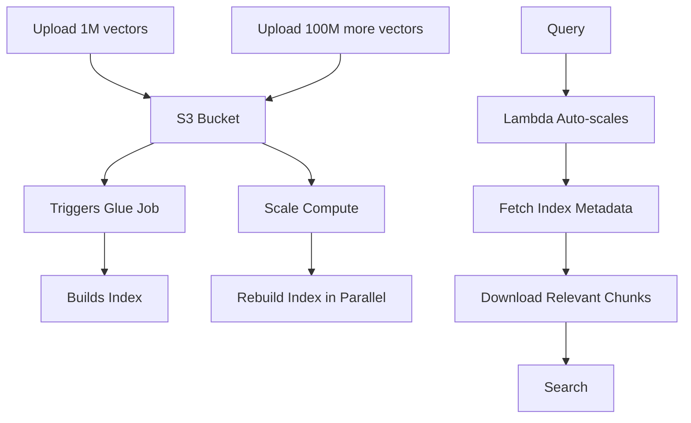

# Section 7: Cloud-Native Vector Storage (AWS S3)

The future of vector search. We move from "database management" to "serverless intelligence" powered by object storage.

---

## Topic 1: Introduction to S3 Vectors (The Paradigm Shift)

### 1. The "How" (Theory)

**Traditional Vector DB Architecture (Coupled)**:
```
┌─────────────────────────┐
│   Qdrant Server         │
│  ┌──────────┐           │
│  │  RAM     │ ← Vectors │
│  └──────────┘           │
│  ┌──────────┐           │
│  │  CPU     │ ← Search  │
│  └──────────┘           │
│  ┌──────────┐           │
│  │  SSD     │ ← Payload │
│  └──────────┘           │
└─────────────────────────┘
```
*   **Problem**: RAM and CPU are physically tied together
*   **Cost**: You pay for both 24/7, even if no one searches at night
*   **Scaling**: To add more storage, you must also add more compute

**S3 Vector Architecture (Decoupled)**:
```
┌─────────────────┐       ┌──────────────────┐
│  S3 Bucket      │       │  Lambda/Fargate  │
│  (Storage)      │◄──────┤  (Compute)       │
│                 │       │                  │
│  - Vectors      │       │  Spins up only   │
│  - Graph Index  │       │  during search   │
│  - Payloads     │       │                  │
└─────────────────┘       └──────────────────┘
     $0.023/GB/mo              $0.0000166/GB-sec
```
*   **Benefit**: Pay for storage separately from compute
*   **Cost**: Storage is 100x cheaper; compute only runs during queries

**Example Cost Comparison**:

| Metric | Qdrant (Self-hosted) | AWS S3 Vectors |
| :--- | :--- | :--- |
| **1B vectors (384D)** | 1.5 TB RAM needed | 500 GB S3 storage |
| **Infrastructure** | r6g.4xlarge (128GB RAM) × 12 nodes | S3 bucket + Lambda |
| **Monthly Cost (Compute)** | $500/node × 12 = $6,000 | $0 (idle), ~$50 (1K queries/day) |
| **Monthly Cost (Storage)** | Included in compute | $500 GB × $0.023 = $11.50 |
| **Total** | ~$6,000/mo | ~$61.50/mo |

### 2. The "Why" (Context)

**Real-World Scenario: Long-Tail Data**

```python
# Your use case:
# - 10M documents (legal archive)
# - Searched 100 times/day (low query volume)
# - Need to keep all data online for compliance

# Qdrant approach:
# Problem: You're paying $500/mo for a server that sits idle 99.9% of the time
# Utilization: <0.1% (wasteful)

# S3 approach:
# Storage: 10M docs × 50 KB = 500 GB → $11.50/mo
# Compute: 100 queries × 200ms × $0.0000166/GB-sec → $0.33/mo
# Total: $11.83/mo
# Savings: 97.6%!
```

**When S3 Makes Sense**:
*   ✅ Low query volume (<10K queries/day)
*   ✅ Large datasets (100M+ vectors)
*   ✅ Batch/Async processing (latency tolerance: 100-500ms)
*   ✅ Cost-sensitive (startups, research, archives)

**When Qdrant Makes Sense**:
*   ✅ High query volume (>100K queries/day)
*   ✅ Low latency required (<50ms)
*   ✅ Real-time applications (chatbots, recommendations)
*   ✅ Complex filters (need advanced payload indexing)

### 3. The "Aha!" Moment 💡
> **"Infinite data, Zero Ops."**

**The Realization**:
When you upload 100 million vectors to S3 and realize:
*   No "cluster resizing" events
*   No "out of memory" errors
*   No "node failure" alerts
*   **It just works**

You understand the power of serverless architecture. The cloud provider handles ALL operational complexity.

---

## Topic 2: Key Features (Serverless Scale & Cost)

### 1. The "How" (Theory)

**AWS S3 Vector Bucket**:
*   **Definition**: An S3 bucket optimized for vector storage
*   **Format**: Stores vectors as columnar files (Parquet/Lance)
*   **Indexing**: Automatically builds ANN (Approximate Nearest Neighbor) index

**The Workflow**:

```python
import boto3
import pandas as pd

# 1. Prepare data
df = pd.DataFrame({
    'id': [1, 2, 3],
    'vector': [[0.1, 0.2, ...], [0.3, 0.4, ...], [0.5, 0.6, ...]],
    'text': ['Doc 1', 'Doc 2', 'Doc 3']
})

# 2. Convert to Parquet
df.to_parquet('vectors.parquet')

# 3. Upload to S3
s3 = boto3.client('s3')
s3.upload_file('vectors.parquet', 'my-vector-bucket', 'vectors/batch_001.parquet')

# 4. Create index (automatically triggered)
# AWS Glue job detects new file
# Builds/updates vector index in background

# 5. Query (via API or integrated service)
# AWS Bedrock, SageMaker, or custom Lambda
```

**Auto-Scaling**:



*   **No Manual Intervention**: Everything scales automatically
*   **Pay-per-Use**: Only pay for compute during indexing and querying

### 2. The "Why" (Context)

**Example: Research Dataset**

```python
# University research project
# Dataset: 500M scientific papers
# Query frequency: 50 queries/day (students running experiments)

# Traditional approach (Qdrant cluster):
# - Need 20 nodes × $500 = $10,000/mo
# - Peak utilization: 3% (students search during work hours only)
# - Waste: $9,700/mo

# S3 Vector approach:
# - Storage: 2 TB × $23 = $46/mo
# - Compute: 50 queries × 500ms × $0.0000166/GB-sec × 2 GB = $0.83/mo
# - Total: $46.83/mo
# - Savings: 99.5%

# ROI: Saved $120K/year → Can hire 2 more researchers!
```

---

## Topic 3: Architecture (IVFFlat vs HNSW)

### 1. The "How" (Theory)

**Why Not HNSW on S3?**

```python
# HNSW Requirements:
# - Entire graph must be in RAM
# - Random access to any node
# - Low-latency navigation (<1ms per hop)

# S3 Reality:
# - Data on remote storage
# - Network latency: 10-50ms per fetch
# - Random access = expensive!

# Conclusion: HNSW is incompatible with remote storage
```

**IVFFlat (Inverted File Index with Flat Search)**:

**Step 1: Clustering (Offline)**
```python
from sklearn.cluster import KMeans

# Cluster 1B vectors into 100K centroids
vectors = load_vectors()  # Shape: (1_000_000_000, 384)

kmeans = KMeans(n_clusters=100_000)
kmeans.fit(vectors)

centroids = kmeans.cluster_centers_  # Shape: (100_000, 384)
labels = kmeans.labels_  # Shape: (1_000_000_000,)

# Save clusters to S3
for cluster_id in range(100_000):
    cluster_vectors = vectors[labels == cluster_id]
    save_to_s3(f"cluster_{cluster_id}.parquet", cluster_vectors)

# Save centroids (small, can fit in RAM)
save_to_s3("centroids.parquet", centroids)
```

**Step 2: Search (Online)**
```python
# Query time
query = embed("What is quantum computing?")

# 1. Load centroids (100K × 384 = ~150 MB, fits in Lambda RAM)
centroids = load_from_s3("centroids.parquet")

# 2. Find nearest centroid (fast, in-memory)
distances = cosine_similarity([query], centroids)[0]
nearest_cluster_id = np.argmin(distances)

# 3. Download ONLY that cluster from S3
cluster_vectors = load_from_s3(f"cluster_{nearest_cluster_id}.parquet")
# Typical cluster size: 10K vectors = ~15 MB download

# 4. Brute-force search within cluster
results = brute_force_search(query, cluster_vectors, k=10)

return results
```

**Performance**:
```python
# Metrics
# - Centroid comparison: 100K × 384D = 5ms (in-memory)
# - S3 download: 15 MB ÷ 100 MB/s = 150ms
# - Cluster search: 10K × 384D = 10ms
# Total: ~165ms

# vs HNSW on Qdrant: ~5ms (33x faster)
# Trade-off: Pay 33x latency for 100x cost savings
```

### 2. The "Why" (Context)

**When Latency Doesn't Matter**:
*   **Batch Analytics**: Process overnight jobs
*   **Data Science**: Jupyter notebooks (human waits anyway)
*   **Document Search**: Internal tools (100-500ms is acceptable)
*   **Archival Systems**: Rarely queried, must keep all data

**The Math**:
```python
# Break-even analysis
# Question: At what query volume does Qdrant become cheaper?

qdrant_cost_monthly = 6000  # Fixed
s3_storage_cost = 11.50     # Fixed
s3_query_cost_per_query = 0.01  # Variable

# Break-even equation:
# 6000 = 11.50 + (queries_per_month × 0.01)
# queries_per_month = (6000 - 11.50) / 0.01
# = 598,850 queries/month
# = ~20,000 queries/day

# Conclusion: Below 20K queries/day, use S3. Above, use Qdrant.
```

---

## Topic 4: Integration (AWS Bedrock & Ecosystem)

### 1. The "How" (Theory)

**Amazon Bedrock Knowledge Base**:

```python
import boto3

bedrock = boto3.client('bedrock-agent')

# 1. Create Knowledge Base
kb_response = bedrock.create_knowledge_base(
    name="AirlinePolicyKB",
    roleArn="arn:aws:iam::123456789:role/BedrockKBRole",
    knowledgeBaseConfiguration={
        "type": "VECTOR",
        "vectorKnowledgeBaseConfiguration": {
            "embeddingModelArn": "arn:aws:bedrock:us-east-1::foundation-model/amazon.titan-embed-text-v1"
        }
    },
    storageConfiguration={
        "type": "OPENSEARCH_SERVERLESS",  # Or S3
        "opensearchServerlessConfiguration": {
            "collectionArn": "arn:aws:aoss:us-east-1:123456789:collection/abc",
            "vectorIndexName": "policies-index"
        }
    }
)

# 2. Add Data Source (S3 bucket)
bedrock.create_data_source(
    knowledgeBaseId=kb_response['knowledgeBaseId'],
    name="PolicyDocuments",
    dataSourceConfiguration={
        "type": "S3",
        "s3Configuration": {
            "bucketArn": "arn:aws:s3:::airline-policies"
        }
    }
)

# 3. Start Ingestion Job
bedrock.start_ingestion_job(
    knowledgeBaseId=kb_response['knowledgeBaseId'],
    dataSourceId="...",
)

# Now Bedrock automatically:
# - Chunks your documents
# - Generates embeddings (Titan model)
# - Stores vectors in your chosen backend
```

**RAG (Retrieval-Augmented Generation) Flow**:

```python
# User asks a question
user_question = "What's the baggage limit for Economy?"

# Bedrock handles EVERYTHING:
bedrock_runtime = boto3.client('bedrock-agent-runtime')

response = bedrock_runtime.retrieve_and_generate(
    input={'text': user_question},
    retrieveAndGenerateConfiguration={
        'type': 'KNOWLEDGE_BASE',
        'knowledgeBaseConfiguration': {
            'knowledgeBaseId': kb_response['knowledgeBaseId'],
            'modelArn': 'arn:aws:bedrock:us-east-1::foundation-model/anthropic.claude-v2'
        }
    }
)

print(response['output']['text'])
# Output: "For Economy class on SkyStream, the baggage limit is 23kg per checked bag..."
```

**What Bedrock Did (Behind the Scenes)**:
1.  Embedded the question using Titan
2.  Searched the vector index
3.  Retrieved top 5 relevant documents
4.  Passed them to Claude as context
5.  Claude generated natural language answer
6.  **Total time**: 2-3 seconds (fully managed)

### 2. The "Why" (Context)

**The Value of Integration**:

```python
# DIY approach (what we've been doing):
# 1. Load embedding model
encoder = SentenceTransformer('all-MiniLM-L6-v2')
# 2. Embed query
query_vec = encoder.encode(question)
# 3. Search Qdrant
results = client.search(query_vector=query_vec, limit=5)
# 4. Extract context
context = "\n".join([r.payload['text'] for r in results])
# 5. Call LLM API
llm_response = openai.ChatCompletion.create(
    model="gpt-4",
    messages=[{"role": "user", "content": f"Context: {context}\n\nQuestion: {question}"}]
)

# AWS Bedrock approach:
response = bedrock.retrieve_and_generate(...)
# Done! (5 lines of code)
```

**The Trade-offs**:

| Aspect | DIY (Qdrant + GPT) | Bedrock (Managed) |
| :--- | :--- | :--- |
| **Setup Time** | 2-3 days | 30 minutes |
| **Code Complexity** | 500+ lines | 50 lines |
| **Ops Burden** | High (manage Qdrant cluster) | Zero (fully managed) |
| **Cost** | $$$$ (compute 24/7) | $ (pay per query) |
| **Flexibility** | Full control | Limited customization |
| **Vendor Lock-in** | None | AWS only |

---

## 🚀 Advanced Topic: LanceDB (Open-Source Alternative)
*(Deep Dive for Section 7)*

### The Problem

**AWS Lock-In**:
*   S3 Vectors are AWS-only
*   If you want multi-cloud, you're stuck

### LanceDB Solution

**What is Lance?**
*   **Format**: Modern columnar storage (like Parquet++), optimized for vectors
*   **Features**: Built-in versioning, zero-copy reads, cloud-native
*   **Open Source**: Apache 2.0 license

**Architecture**:
```python
import lancedb

# Connect to S3 (works with ANY S3-compatible storage)
db = lancedb.connect("s3://my-bucket/lancedb-data")

# Create table
table = db.create_table(
    "policies",
    data=[
        {"id": 1, "vector": [0.1, 0.2, ...], "text": "..."},
        {"id": 2, "vector": [0.3, 0.4, ...], "text": "..."},
    ]
)

# Search (uses DiskANN algorithm)
results = table.search([0.15, 0.25, ...]).limit(10).to_list()
```

**Key Advantages**:

1.  **Storage Flexibility**: Works with S3, Azure Blob, GCS, MinIO, local disk
2.  **Cost**: Same low S3 storage costs as AWS solution
3.  **Algorithm**: DiskANN (Microsoft Research) - optimized for SSD/cloud storage
4.  **Version Control**: Built-in time travel (query data at any point in time)

**DiskANN Performance**:
```python
# DiskANN magic
# Problem: Reading random chunks from disk is slow

# Solution: Graph structure + smart prefetching
# 1. Build graph that minimizes disk seeks
# 2. Prefetch neighbor nodes into RAM before they're needed
# 3. Use SSD parallel I/O (NVMe: 7 GB/s bandwidth)

# Result:
# - 1B vectors on NVMe SSD
# - Latency: ~10ms (vs ~5ms for Qdrant in RAM)
# - Cost: 1/10th (SSD = $0.10/GB, RAM = $1/GB)
```

**Example - Multi-Cloud**:
```python
# Primary: AWS S3
db_aws = lancedb.connect("s3://aws-bucket/vectors")

# Replica: Google Cloud Storage
db_gcp = lancedb.connect("gs://gcp-bucket/vectors")

# Local cache (fast development)
db_local = lancedb.connect("./local-cache")

# Same API for all!
results_aws = db_aws.open_table("policies").search(query).limit(10)
results_gcp = db_gcp.open_table("policies").search(query).limit(10)
```

### When to Choose Each

| Use Case | AWS S3 Vectors | LanceDB | Qdrant |
| :--- | :--- | :--- | :--- |
| **Fully Managed** | ✅ | ❌ (DIY) | ⚠️ (Qdrant Cloud) |
| **Multi-Cloud** | ❌ | ✅ | ✅ |
| **Open Source** | ❌ | ✅ | ✅ |
| **Ultra-Low Latency** | ❌ (100-500ms) | ⚠️ (10-50ms) | ✅ (<5ms) |
| **Billion-Scale** | ✅ | ✅ | ✅ |
| **Cost (Low QPS)** | ✅ Best | ✅ Best | ❌ Expensive |
| **AWS Integration** | ✅ Native | ⚠️ Manual | ⚠️ Manual |

**The Future**:
LanceDB is rapidly evolving. It represents the "best of both worlds":
*   Serverless/cloud-native like AWS
*   Open-source and portable
*   Near-RAM performance on SSD

This is the technology that will power the next generation of vector applications!
